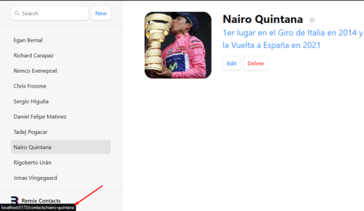
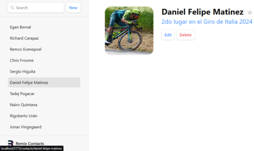
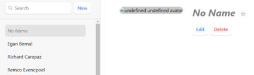
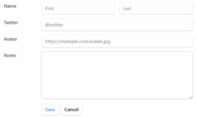

# My Remix App
## Getting Started

### 1. Install dependencies
Run the following command to install the required dependencies:
```
npm install
```
This will create the node_modules folder in your project.

### 2. Start the development server
To start your app in development mode, use:
```
npm run dev
```

## App Result
By clicking on any item in the sidebar, the main section displays the name, achievements and image of the selected rider.



## New features
A new feature has been added to the application. The `New` button now allows you to create a new item in the list. In the main section, default information is displayed. By clicking the `Edit` button, you can input the following details: first name, last name, description, image URL, and notes. To save this information, simply click `Save`, and the new item will appear in the list.



## Remix concepts

### 1. Link Component
Remix provides the `Link` component for navigation between pages without reloading the entire app. This improves performance and user experience by only loading the necessary data for the new view.
Import the Link component like this:
```
import { Link } from "@remix-run/react";
```
Example:
```
<Link to="/ruta">Texto del enlace</Link>
```

### 2. Loaders
A `loader` is a function that gets data from the server before rendering a page or component. This ensures the required data is available when the user sees the page.
```
// Loader: function that obtains data from the server
export const loader = async () => {
  const products = await fetch("https://api.example.com/productos").then((res) =>
    res.json()
  );
  return products; // Returns data to the component
};
```
In the component, use `useLoaderData()` to access the loader's data:
```
import { useLoaderData } from "@remix-run/react";

export default function Productos() {
  const products = useLoaderData(); // Gets data from the loader
}
```

### 3. Dynamic Routes
Dynamic routes allow parts of a URL to be variable. For example, in the `routes` folder, you can create a file named `$id.tsx` to handle URLs like `/products/1`.
Example: File structure:
```
app/routes/products/$id.tsx
```
When accessing `/products/1`, the loader will fetch the data for the product with ID 1.

### 4. Nested Routes
Nested routes enable parent pages to render child pages within a shared layout.
Example: File structure:
```
app/
└── routes/
    ├── about.jsx        // parent path
    ├── about.mision.jsx // child path
    └── about.equipo.jsx // other child path
```

### 5. Outlet Component
The `Outlet` component renders child routes within a parent route.
Example:
Parent route (`about.jsx`):
```
import { Outlet } from "@remix-run/react";

export default function About() {
  return (
    <div>
      <h1>About Us</h1>
      <Outlet />
    </div>
  );
}
```

Child route (`about.mision.jsx`):
```
export default function Mision() {
  return <p>Our mission is to teach Remix</p>;
}
```

When you visit `/about/mission`, Remix combines the layouts:
```
<h1>About Us</h1>
<p>Our mission is to teach Remix</p>
```